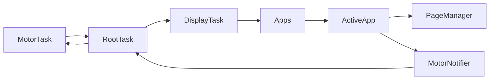

# Firmware Apps Architecture and Design Guide

Scope: firmware “apps” (not “components”): runtime architecture, data flow, UI primitives, motor integration, navigation, and app-specific patterns with references into the codebase.

Overview
- System tasks and orchestration:
  - Entrypoint [setup()](firmware/src/main.cpp:71) wires Display, Root, Motor, Sensors, Reset; logging and EEPROM init handled earlier in the file.
  - Display initializes LVGL and owns the shared LVGL mutex: [DisplayTask::run()](firmware/src/display_task.cpp:50). Demo apps are created and rendered via [DisplayTask::enableDemo()](firmware/src/display_task.cpp:86).
  - Root is the hub for state flow, navigation, and motor updates: [RootTask::run()](firmware/src/root_task.cpp:75).
  - Motor handles FOC loop, haptics, and publishes [PB_SmartKnobState]: [MotorTask::run()](firmware/src/motor_foc/motor_task.cpp:40).
- Two UI frameworks coexist:
  - “Apps” framework (this document): [class Apps](firmware/src/apps/apps.h:19), [class App](firmware/src/apps/app.h:32), [Menu](firmware/src/apps/menu.h:37).
  - “Components” framework mirrors the Apps pattern and is managed by ComponentManager, but is out of scope here; see [Component Development Guide](docs/Firmware/component_development.md).

Data flow and event loop
- Motor → Root:
  - [MotorTask::publish()](firmware/src/motor_foc/motor_task.cpp:414) writes PB_SmartKnobState to [RootTask::knob_state_queue_](firmware/src/root_task.cpp:53).
  - [RootTask::run()](firmware/src/root_task.cpp:317) receives the latest state and builds [AppState](firmware/src/app_config.h:66) with proximity and screen info.
- Root → Apps:
  - If not in component mode, forward to [Apps::update()](firmware/src/apps/apps.cpp:20). Routing guard: matches state.config.id to [App::app_id](firmware/src/apps/app.h:70) [Apps::update()](firmware/src/apps/apps.cpp:29).
  - The active app’s [App::updateStateFromKnob()](firmware/src/apps/app.h:40) produces an [EntityStateUpdate](firmware/src/app_config.h:75) when meaningful changes occur.
- Apps → Motor:
  - Apps update their [PB_SmartKnobConfig] and call [App::triggerMotorConfigUpdate()](firmware/src/apps/app.cpp:66).
  - [MotorNotifier::requestUpdate()](firmware/src/notify/motor_notifier/motor_notifier.h:17) delivers configs to Root via a callback registered in [RootTask::run()](firmware/src/root_task.cpp:207), which applies them with [RootTask::applyConfig()](firmware/src/root_task.cpp:730) → [MotorTask::setConfig()](firmware/src/motor_foc/motor_task.cpp:376).
- Root → Display:
  - Root broadcasts [AppState] to the display or other listeners via [RootTask::publish()](firmware/src/root_task.cpp:715).
- Auto broadcast and button handling:
  - Root handles press events, haptics, and auto-broadcast policies in [RootTask::updateHardware()](firmware/src/root_task.cpp:446) and [RootTask::checkAndBroadcastState()](firmware/src/root_task.cpp:792).

App framework
- Base class [App](firmware/src/apps/app.h:32):
  - Lifecycle and rendering: [App::render()](firmware/src/apps/app.cpp:48) swaps to the app’s LVGL screen; [App::initScreen()](firmware/src/apps/app.h:74) is overridden to build UI.
  - State and navigation hooks: [updateStateFromKnob()](firmware/src/apps/app.h:40), [updateStateFromSystem()](firmware/src/apps/app.h:42), [handleNavigation()](firmware/src/apps/app.h:44).
  - Navigation targets: [navigationNext()](firmware/src/apps/app.h:52), [navigationBack()](firmware/src/apps/app.h:57) with sentinel returns (e.g., [DONT_NAVIGATE_UPDATE_MOTOR_CONFIG](firmware/src/apps/app.h:28)).
  - Motor configuration: [getMotorConfig()](firmware/src/apps/app.cpp:87), [triggerMotorConfigUpdate()](firmware/src/apps/app.cpp:66); identifiers [app_id](firmware/src/apps/app.h:70) must be copied into motor_config.id for routing.
- App registry and menu [Apps](firmware/src/apps/apps.h:19):
  - Add/activate: [Apps::add()](firmware/src/apps/apps.cpp:8), [Apps::setActive()](firmware/src/apps/apps.cpp:44), [Apps::render()](firmware/src/apps/apps.cpp:39).
  - Menu composition: [Apps::updateMenu()](firmware/src/apps/apps.cpp:130) builds [Menu](firmware/src/apps/menu.h:37) pages using app icons and friendly names.
  - Navigation dispatch: [Apps::handleNavigationEvent()](firmware/src/apps/apps.cpp:186) interprets [NavigationEvent](firmware/src/navigation/navigation.h:3) and switches active apps or requests motor config updates (via sentinel codes).

UI primitives and composition
- Per-app LVGL screen is created in [App::App()](firmware/src/apps/app.cpp:4) under the shared LVGL mutex.
- Page composition:
  - [class BasePage](firmware/src/display/page_manager.h:7) provides [show()](firmware/src/display/page_manager.h:19), [hide()](firmware/src/display/page_manager.h:26), [update()](firmware/src/display/page_manager.h:33), [handleNavigation()](firmware/src/display/page_manager.h:43).
  - [PageManager<T>](firmware/src/display/page_manager.h:54) registers pages and switches them atomically under mutex via [show()](firmware/src/display/page_manager.h:71).
- Common widgets:
  - Circular arcs as value/indicator: [SwitchApp::initScreen()](firmware/src/apps/switch/switch.cpp:51), [DimmerPage::DimmerPage()](firmware/src/apps/light_dimmer/pages/dimmer.cpp:3), [ClimateApp::initTemperatureArc()](firmware/src/apps/climate/climate.cpp:101).
  - Labels and icons: [MenuPage::MenuPage()](firmware/src/apps/menu.h:9), [ClimateApp::initScreen()](firmware/src/apps/climate/climate.cpp:43), [LightDimmerApp::LightDimmerApp()](firmware/src/apps/light_dimmer/light_dimmer.cpp:19).
- LVGL thread-safety: wrap LVGL calls with the shared mutex using [SemaphoreGuard](firmware/src/apps/app.cpp:7).

Navigation model
- Events: [NavigationEvent](firmware/src/navigation/navigation.h:3) enumerates NO, SHORT, LONG.
- Root’s button handling:
  - Normal apps mode: dispatch SHORT/LONG into [Apps::handleNavigationEvent()](firmware/src/apps/apps.cpp:186) with haptic via [MotorTask::playHaptic()](firmware/src/motor_foc/motor_task.cpp:386) [RootTask::updateHardware()](firmware/src/root_task.cpp:520).
  - Component mode: encode presses into press_nonce (no app navigation) [RootTask::updateHardware()](firmware/src/root_task.cpp:455).
- In-app navigation:
  - Intercept with [DONT_NAVIGATE_UPDATE_MOTOR_CONFIG](firmware/src/apps/app.h:29) to keep focus within the app while swapping motor_config, e.g. [LightDimmerApp::navigationNext()](firmware/src/apps/light_dimmer/light_dimmer.cpp:103).
  - Use [Menu](firmware/src/apps/menu.cpp:8) pages for top-level app switching; [Menu::set_menu_position()](firmware/src/apps/menu.cpp:41) binds next_ to the selected app.

Motor integration and haptics
- Update path:
  - App calls [App::triggerMotorConfigUpdate()](firmware/src/apps/app.cpp:66) → [MotorNotifier::requestUpdate()](firmware/src/notify/motor_notifier/motor_notifier.h:17).
  - Root receives via the notifier callback installed in [RootTask::run()](firmware/src/root_task.cpp:207) and calls [applyConfig()](firmware/src/root_task.cpp:730) → [MotorTask::setConfig()](firmware/src/motor_foc/motor_task.cpp:376).
- Motor loop:
  - Torque and detent behavior computed from config fields in [MotorTask::run() CONFIG](firmware/src/motor_foc/motor_task.cpp:160) and main loop logic (detent centers, dead zone, bounds) around lines [MotorTask::run()](firmware/src/motor_foc/motor_task.cpp:292).
- Haptic clicks and presses: [MotorTask::playHaptic()](firmware/src/motor_foc/motor_task.cpp:386) invoked from [RootTask::updateHardware()](firmware/src/root_task.cpp:405).

App deep-dives
- LightDimmer
  - Navigation structure: [LightDimmerApp::handleNavigation()](firmware/src/apps/light_dimmer/light_dimmer.cpp:28) uses SHORT for page transitions; LONG persists sub-page config and returns to main.
  - Motor configs: [dimmer_config](firmware/src/apps/light_dimmer/light_dimmer.h:49), [page_selector_config](firmware/src/apps/light_dimmer/light_dimmer.h:65), [hue_config](firmware/src/apps/light_dimmer/light_dimmer.h:81), [temp_config](firmware/src/apps/light_dimmer/light_dimmer.h:97). All ids set to app_id in [ctor](firmware/src/apps/light_dimmer/light_dimmer.cpp:11).
  - UI composition: [LightDimmerPageManager](firmware/src/apps/light_dimmer/light_dimmer.h:22), [DimmerPage::update()](firmware/src/apps/light_dimmer/pages/dimmer.cpp:39), [PageSelector::update()](firmware/src/apps/light_dimmer/pages/page_selector.cpp:24).
  - State emission: brightness/hue/temp JSON in [updateStateFromKnob()](firmware/src/apps/light_dimmer/light_dimmer.cpp:117).
- Switch
  - Motor config: two-state with snap_point≈0.55 [SwitchApp::SwitchApp()](firmware/src/apps/switch/switch.cpp:9), identifier set in [SwitchApp::SwitchApp()](firmware/src/apps/switch/switch.cpp:25).
  - UI and animation: [initScreen()](firmware/src/apps/switch/switch.cpp:51); velocity-based arc updates and bounds clamping in [updateStateFromKnob()](firmware/src/apps/switch/switch.cpp:101).
  - State emission: minimal {on} JSON in [updateStateFromKnob()](firmware/src/apps/switch/switch.cpp:171); app_slug selection per type lines [updateStateFromKnob()](firmware/src/apps/switch/switch.cpp:183).
- Climate
  - Motor config: bounded range sized to temps [ClimateApp::ClimateApp()](firmware/src/apps/climate/climate.cpp:15).
  - UI composition and updates: [initScreen()](firmware/src/apps/climate/climate.cpp:43), [initTemperatureArc()](firmware/src/apps/climate/climate.cpp:101), [updateTemperatureArc()](firmware/src/apps/climate/climate.cpp:206), [updateModeIcon()](firmware/src/apps/climate/climate.cpp:263).
  - Navigation: cycles modes and swaps bounds [navigationNext()](firmware/src/apps/climate/climate.cpp:378).
  - State emission: {mode,target_temp,current_temp} in [updateStateFromKnob()](firmware/src/apps/climate/climate.cpp:324).

Generalized segment structure for a new app
- Purpose and interaction model
  - What the app controls; continuous vs discrete; expected physical feel.
- Motor configuration design
  - Initial [PB_SmartKnobConfig] schema: min/max, position_width_radians, detent_strength_unit, endstop_strength_unit, snap_point, detent_positions.
  - Set motor_config.id = app_id; see [ClimateApp::ClimateApp()](firmware/src/apps/climate/climate.cpp:31).
  - Update policy: when to call [triggerMotorConfigUpdate()](firmware/src/apps/app.cpp:66); when to increment position_nonce.
- UI layout and primitives
  - LVGL objects per page; use [BasePage](firmware/src/display/page_manager.h:7) and [PageManager<T>](firmware/src/display/page_manager.h:54) if multi-page.
  - Visual feedback rules (colors, arcs, labels); mutex discipline with [SemaphoreGuard](firmware/src/apps/app.cpp:7).
- Navigation semantics
  - SHORT/LONG mapping; whether to return [DONT_NAVIGATE_UPDATE_MOTOR_CONFIG](firmware/src/apps/app.h:29) or switch apps.
  - Internal page transitions handled in [handleNavigation()](firmware/src/apps/app.h:44).
- State model and emission
  - JSON fields and change detection; examples: [SwitchApp::updateStateFromKnob()](firmware/src/apps/switch/switch.cpp:171), [LightDimmerApp::updateStateFromKnob()](firmware/src/apps/light_dimmer/light_dimmer.cpp:166).
- Registration and menu integration
  - Added via [Apps::add()](firmware/src/apps/apps.cpp:8) or [Apps::loadApp()](firmware/src/apps/apps.cpp:68); invoke [Apps::updateMenu()](firmware/src/apps/apps.cpp:130).
- Edge handling and haptics
  - Bounds shaping near min/max; example: [ClimateApp::updateStateFromKnob()](firmware/src/apps/climate/climate.cpp:335), [LightDimmerApp::updateStateFromKnob()](firmware/src/apps/light_dimmer/light_dimmer.cpp:130).
  - Play haptic cues via [MotorTask::playHaptic()](firmware/src/motor_foc/motor_task.cpp:386) orchestrated in [RootTask::updateHardware()](firmware/src/root_task.cpp:405).

Practical checklist for implementing a new app
- Subclass [App](firmware/src/apps/app.h:32); set app_id, friendly_name, entity_id; copy id into motor_config.id.
- Build UI in [initScreen()](firmware/src/apps/app.h:74) or page constructors under the LVGL mutex.
- Choose interaction pattern:
  - Continuous fine adjust: see [LightDimmerApp::dimmer_config](firmware/src/apps/light_dimmer/light_dimmer.h:49).
  - Binary toggle: see [SwitchApp::SwitchApp()](firmware/src/apps/switch/switch.cpp:9).
  - Bounded range: see [ClimateApp::ClimateApp()](firmware/src/apps/climate/climate.cpp:15).
- Implement [updateStateFromKnob()](firmware/src/apps/app.h:40); update visuals and motor_config.position; emit JSON on changes.
- Define navigation behavior with [navigationNext()](firmware/src/apps/app.h:52), [navigationBack()](firmware/src/apps/app.h:57), and [handleNavigation()](firmware/src/apps/app.h:44).
- Call [triggerMotorConfigUpdate()](firmware/src/apps/app.cpp:66) whenever motor_config changes.
- Register in [Apps](firmware/src/apps/apps.h:19); ensure [Apps::updateMenu()](firmware/src/apps/apps.cpp:130) is invoked.

Mermaid overview

Notes on host-side integration (brief)
- Host packets are received in [SerialProtocolProtobuf::handlePacket()](firmware/src/proto/serial_protocol_protobuf.cpp:88), validated (CRC/COBS), decoded, ACKed, and dispatched by tag or command.
- Root registers tag/command handlers in [RootTask::run()](firmware/src/root_task.cpp:87) to react to settings, calibration, request_state, and app_component messages (components system).
- The classic Apps system is local; external control typically sets OS mode and renders demo apps via [DisplayTask::enableDemo()](firmware/src/display_task.cpp:86).

Appendix: common pitfalls
- If your app doesn’t receive updates: ensure motor_config.id matches [app_id](firmware/src/apps/app.h:70) and the app is active.
- If LVGL glitches occur: guard all LVGL calls with the shared mutex; see [App::App()](firmware/src/apps/app.cpp:4) and [DisplayTask::run()](firmware/src/display_task.cpp:50).
- If motor config seems ignored: increment position_nonce when swapping configs and ensure [triggerMotorConfigUpdate()](firmware/src/apps/app.cpp:66) is called; Root will apply via notifier.